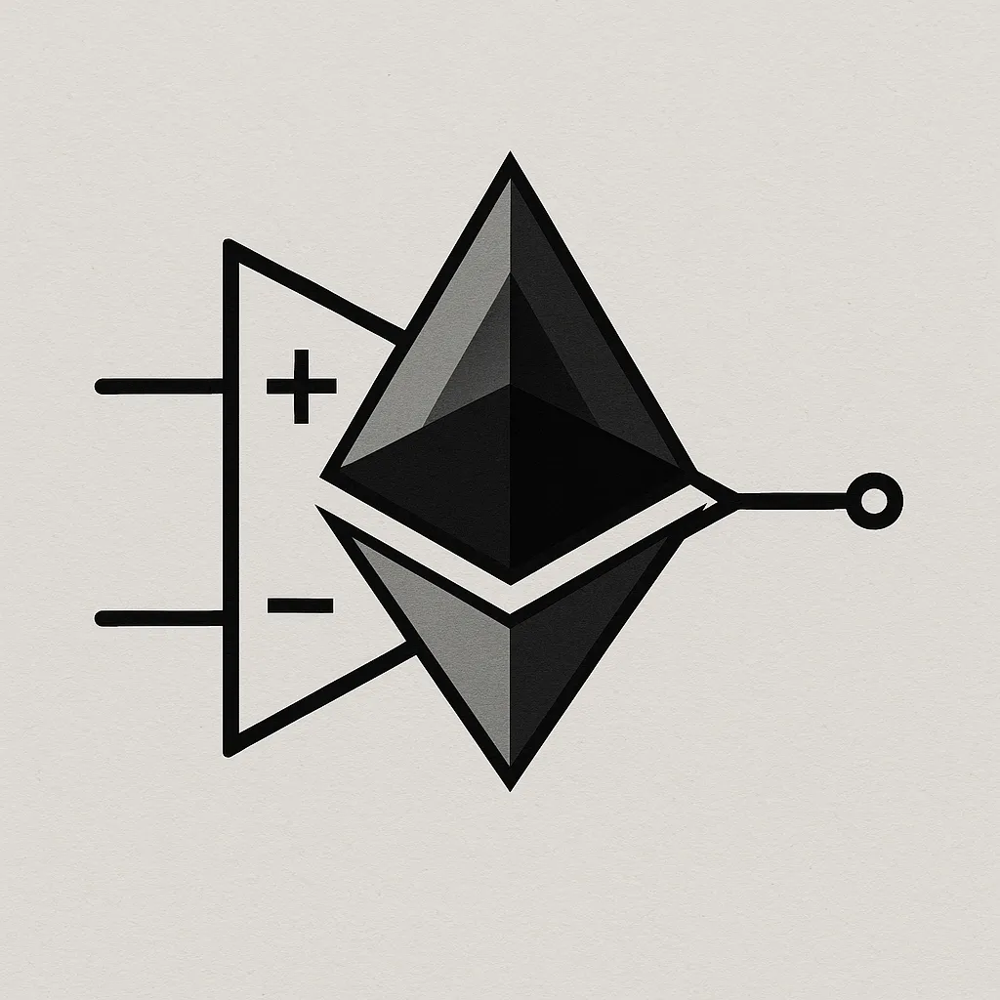

## Signal-Boost

**Signal-Boost is a PoC implementation of the ideas in the [Signal-Boost](https://ethresear.ch/t/signal-boost-l1-interop-plugin-for-rollups/22354) ethresearch post.**

### Summary
Signal-Boost is a set of L1 contracts for rollups to synchronously read L1 data in real-time. It provides a way to batch and verify signals (data) from L1 to L2, with support for top-of-block inclusion and multiple rollup stacks (Taiko and OP Stack).

### Core Contracts
- **SignalBoost.sol**: The main contract that queries L1 view function, batches outputs, then broadcasts a signal to the rollup's L1 contract.
- **SignalProver.sol**: Allows the raw view function data to be written to L2 state if it is proven against the committed signal.
- **SignalReceiver.sol**: L2 contract that receives and stores signals from L1. Acts as the bridge for cross-domain communication. Each rollup is expected to have its own implementation.
- **Batcher.sol**: Basic EIP-7702 batcher implementation to execute multiple transactions atomically.
- **TobascoBatcher.sol**: EIP-7702 batcher implementation that enforces top-of-block inclusion utilizing [Tobasco](https://github.com/eth-fabric/tobasco).

### Implementation Variants

- **SignalBoostTaiko.sol**: Taiko-specific implementation that uses Taiko's `SignalService` for cross-chain messaging.
- **SignalBoostOpStack.sol**: OP Stack-specific implementation that uses Optimism's `CrossDomainMessenger` for cross-chain messaging.

### Disclaimer
This project is not audited and is not ready for production use. Please see Terms of Use (https://github.com/Commit-Boost/commit-boost-client/blob/main/TERMS-OF-USE.md) for more details.
